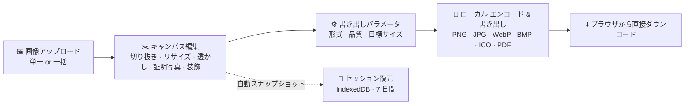

<div align="center">


# PhotoChange

**完全フロントエンドの画像ワークベンチ——切り抜き · リサイズ · 証明写真 · 透かし · 一括変換、すべてローカルで**

[](https://github.com/Mocas-12/photochange/actions/workflows/ci.yml)
[](https://mocas-12.github.io/photochange/)
[](https://developer.mozilla.org/zh-CN/docs/Web/HTML)
[](https://developer.mozilla.org/zh-CN/docs/Web/JavaScript)
[](https://github.com/parallax/jsPDF)

**[🌐 ライブプレビュー (GitHub Pages)](https://mocas-12.github.io/photochange/)**

[English](./README.md) | [简体中文](./README.zh-CN.md) | **日本語**

*ページを開く → 下へスクロールしてワークベンチへ → 画像をドロップして編集・書き出し*

</div>

---

## 📖 目次

- [特徴](#-特徴)
- [UI デザイン](#-ui-デザイン)
- [仕組み](#-仕組み)
- [プロジェクト構成](#-プロジェクト構成)
- [クイックスタート](#-クイックスタート)
- [テスト](#-テスト)
- [開発者を応援する](#-開発者を応援する)
- [FAQ](#-faq)
- [プライバシー & セキュリティ](#-プライバシー--セキュリティ)
- [ライセンス](#-ライセンス)

## ✨ 特徴

- 🖼️ **多彩なアップロード方法**：ボタン選択にもドラッグ & ドロップにも対応。PNG / JPG / JPEG / WebP / BMP / AVIF / HEIC をサポート。複数選択で一括モードが有効に
- 🔍 **キャンバス ビューア**：ズーム（20%〜400%）、±90° 回転、位置合わせ用の定規グリッド
- ✂️ **自由切り抜き**：自由 / 1:1 / 4:3 / 16:9 / 3:2 のアスペクト比。選択範囲の外は半透明マスクでプレビューを明確に
- 📐 **リサイズ**：幅/高さ入力にアスペクト比ロック。アバター、1 寸 / 2 寸証明写真、公式アカウント カバー、小紅書、HD/FHD などのプリセット内蔵
- 💧 **透かし**：テキストまたはロゴ画像、単一（9 分割グリッド配置） or タイル状斜めの盗用防止モード、不透明度とサイズ制御
- 🪪 **証明写真ツール**：ワンクリック背景色置換（白 / 青 / 赤 + カスタム、元の色を自動検出、エッジ フェザリング）と 4×6 インチ用紙への自動レイアウト（300 DPI、印刷対応）
- 🎀 **装飾**：角丸と写真フレーム、色はカスタム可
- 📦 **一括モード**：複数ファイルを選択し、透かし / サイズ / 書き出し設定を全ファイルに適用。ファイルごとのステータス リスト付き
- ↩️ **元に戻す / リセット**：最大 20 ステップの取り消し（Ctrl+Z）、ワンクリックで元画像へリセット
- 💾 **多形式書き出し**：PNG / JPG / WebP / BMP / ICO / PDF（A4 ページに自動フィット & 中央配置）
- 🎯 **目標サイズ圧縮**：「N KB に圧縮」が品質パラメータを二分探索して自動で最も近い品質を探す
- 📊 **ライブ推定**：キャンバス右下のバッジに現在の形式・解像度・書き出しサイズを表示
- 🔄 **セッション復元**：編集スナップショットをローカル自動保存（IndexedDB、7 日間有効）。リフレッシュや誤って閉じてもワンクリックで復元
- 📲 **PWA**：ホーム画面にインストール可能。サービス ワーカーがアプリ シェルをキャッシュしオフラインで動作
- 🔒 **プライバシー**：書き出しはキャンバス再エンコードを経由するため、EXIF メタデータ（GPS 位置情報を含む）は自動で除去
- 💛 **開発者応援モデル**：完全無料——書き出し無制限、機能ロックなし、アカウント不要。役に立ったらコーヒーをおごっていただけると嬉しいです

## 🎨 UI デザイン

| 要素 | デザイン |
| --- | --- |
| テーマ | Deep Space Glow：漆黒に近い青ベース + 3 層のアンビエント グロー |
| パネル | ガラスモーフィズム：半透明背景 + 背景ブラー + 細いボーダー |
| アクセント | 青→紫グラデーションのプライマリ ボタン + 外側グロー |
| ページレイアウト | ホーム / ワークベンチの 2 面フルページ切替（ホイール · タッチ · キーボード · 矢印） |
| キャンバス | 定規グリッド テクスチャ + 空状態ヒント + 右下の情報バッジ |
| モーション | ヒーローのステッガード登場、タイトルのグラデーション パン、ポインター パララックス、ときどき流星、呼吸するドロップゾーン、ボタンの光沢。システムの「動きを減らす」設定を尊重 |

## 🧠 仕組み



1. **ローカル読み込み**：ファイルは `createObjectURL` + `Image` でデコードされ作業キャンバスに描画（長辺 4096 px 上限）。HEIC/AVIF はセルフホストの heic2any を経由。元画像は別途保持されワンクリックでリセット可能
2. **非破壊編集**：切り抜き / リサイズ / 透かし / 調整はすべて Canvas で実行され、各ステップは取り消しスタックへ積まれる（最大 20 ステップ、メモリ上限付きで大きな写真でもタブがクラッシュしない）
3. **証明写真の背景置換**：四隅から元の背景色を自動検出。許容範囲内のピクセルを新しい色に置き換え、エッジは smoothstep でフェザー。「印刷レイアウト」は 4×6 インチ用紙に 300 DPI でタイル配置
4. **サイズ圧縮**：目標サイズを設定すると、品質パラメータの二分探索（0.05〜0.95、最大 9 ラウンド）で目標以内に収まる最高品質を選ぶ
5. **PDF 書き出し**：キャンバスを JPEG に変換し jsPDF で A4 ページに埋め込み、自動スケール & 中央配置
6. **セッション & オフライン**：編集は IndexedDB にスナップショット（透かし/調整メタデータ込み）され、7 日以内のリフレッシュ後なら復元可能。サービス ワーカーがアプリ シェルをキャッシュし、インストールした PWA はオフラインで動作
7. **完全ローカル**：画像と書き出し結果がブラウザの外に出ることはない——サーバは一切介在しない。書き出しはキャンバス再エンコードを経由し、EXIF メタデータ（GPS 含む）を自動除去

## 📁 プロジェクト構成

```text
photochange/
├── index.html          # シングルページ構成：ワークベンチ + カスタム トースト オーバーレイ（インライン スクリプトなし、CSP 強制）
├── style.css           # Deep Space Glow テーマ（ガラスモーフィズム + アンビエント グロー + セルフホスト Inter）
├── main.js             # 編集オーケストレータ：切り抜き / リサイズ / 透かし / 書き出しフロー
├── js/
│   ├── exporters.js    # 純粋エンコーダ：BMP / ICO / 目標サイズ二分探索 / オンデマンド jsPDF
│   ├── state.js        # 共有ミュータブル編集状態（main/crop/watermark の共通土台）
│   ├── crop.js         # 切り抜き & キャンバス ジェスチャ：選択ドラッグ / キーボード切り抜き / ピンチ ズーム
│   ├── watermark.js    # 透かし：テキスト/画像 × 9 分割/タイル。プレビュー & 書き出しで同一の描画コア
│   ├── session.js      # セッション ストレージ：IndexedDB 読み書き
│   ├── view-tools.js   # ビュー変換：ズーム / 回転 / 反転 / 定規 + ツールバー表示切替
│   ├── alerts.js       # カスタム アラート オーバーレイ：フォーカス管理 + 背景を inert 化
│   └── bootstrap.js    # 訪問カウンター フォールバック + サービス ワーカー登録
├── fonts/              # セルフホスト Inter 可変フォント（latin サブセット）
├── scripts/            # lighthouse-run.mjs：Lighthouse 品質ゲート（しきい値アサーション）
├── page-switch.js      # ホーム ↔ ワークベンチのフルページ切替
├── info-badge.js       # ステータス バッジ：解像度 & サイズのライブ推定
├── pointer-fx.js       # ポインター追従エフェクト（ワークベンチ ページでは自動一時停止）
├── manifest.webmanifest / service-worker.js  # PWA：インストール可能 + オフライン シェル（プリキャッシュ リストは自動生成）
├── vendor/             # セルフホスト ライブラリ（jsPDF、heic2any——いずれもオンデマンド読み込み）
├── tests/              # Playwright スイート（npm test）
└── wechatpay/
    └── wechatpay.jpg   # 支払い QR コード画像
```

## 🚀 クイックスタート

依存のインストールは不要——任意の静的サーバでローカル実行できます：

```bash
git clone https://github.com/Mocas-12/photochange.git
cd photochange
python -m http.server 5173
# ブラウザで http://localhost:5173/ を開く
```

| コマンド | 説明 |
| --- | --- |
| `python -m http.server 5173` | Python 内蔵の静的サーバ（推奨） |
| `npx serve .` | Node ベースの代替 |

> `main` ブランチへの push で GitHub Pages のライブ サイトが自動更新されます——手動ビルド不要。

## 🧪 テスト

スモーク テストと Lighthouse 品質ゲートは CI で毎回の push/PR に自動実行されます（両方通過しないとデプロイされません）。ローカルで実行するには：

```bash
npm install
npx playwright install chromium
npm test            # Playwright スイート
npm run lighthouse  # Lighthouse 監査（性能の数値指標 + a11y/best-practices/SEO しきい値）
```

34 テストが、切り抜き座標マトリクス（回転 × 反転）、リサイズ 3 フィット モード、透かし 9 分割配置、キーボード切り抜き、書き出しポリシー、目標サイズ書き出し、BMP/ICO エンコーダ、描画リグレッション（固定 op 列の決定論的ピクセル アサーション）、初回画面サイズ バジェット、JS 関数カバレッジ ベースライン、モバイル ビューポートの E2E、取り消し、証明写真の背景置換 & 印刷レイアウト、装飾、タイル透かし、一括モード、セッション復元（パラメータ + ビュー変換）、2 面ページ切替をカバーします。

## 💛 開発者を応援する

このプロジェクトは**開発者応援モデル**で運営しています。ここにはっきり明記します：

- **完全無料**：全機能が無制限——書き出し上限なし、機能ロックなし、アカウント不要
- **ペイウォールなし**：ライセンス コードも「pro」ティアも存在しません。もし過去の表現がそうであったかのように見えたなら、それは古いドキュメントです——ツール自体は当初から完全ローカル・完全機能で動いています
- **応援は任意**：このツールが役に立ったら、[作者にコーヒーをおごる](https://mbd.pub/o/bread/mbd-YZWblJ9paA==)（書き出しバーにもリンクがあります）。純粋な任意の感謝であり、ロックされたものがないため何もアンロックされません
- 頂いた支援はドメイン、CDN、継続開発に使わせていただきます

## ❓ FAQ

<details>
<summary><b>印刷できる証明写真シートを作るには？</b></summary>

- <b>証明写真（ID Photo）</b>を開く：元の背景色を自動検出——白 / 青 / 赤（またはカスタム色）を選んで適用。次に<b>印刷レイアウト</b>をクリックすると、4×6 インチ用紙（300 DPI）にタイル配置され、印刷して切るだけの状態に。<b>リサイズ</b>内蔵の 1 寸 / 2 寸プリセットで先に標準サイズへ出すのがおすすめ
</details>

<details>
<summary><b>複雑な背景でも背景置換は使える？</b></summary>

- ほぼ均一な背景（スタジオ風の証明写真、無地背景）なら色距離マッチングで動作します。ゴチャゴチャした背景やグラデーション背景には AI マッティングが必要で、現時点では内蔵していません
</details>

<details>
<summary><b>一括書き出し中にブラウザが「複数ダウンロードを許可」と聞いてくる</b></summary>

- 許可してください。各画像は元のファイル名の個別ファイルとして書き出され、一括パネルにファイルごとのステータスと出力サイズが表示されます
</details>

<details>
<summary><b>誤ってリフレッシュして編集が消えた</b></summary>

- 編集はローカル自動保存（IndexedDB）されています。7 日以内にページを開き直し、バナーの<b>復元</b>をクリックすれば続きから作業できます
</details>

<details>
<summary><b>PNG に「品質」オプションがないのは？</b></summary>

- PNG は可逆圧縮で、非可逆の「品質」パラメータが存在しません。ファイル サイズは主に画像内容と解像度で決まります
</details>

<details>
<summary><b>「N KB に圧縮」を設定したのに書き出した PNG が小さくならない</b></summary>

- PNG は目標サイズへの圧縮ができません。アプリはトーストで通知し、自動で JPG 圧縮にフォールバックして書き出します
</details>

<details>
<summary><b>PDF の鮮明さはどのくらい？</b></summary>

- 実際には現在のキャンバスを JPEG として PDF に埋め込んでいます。鮮明さはキャンバスの解像度次第——必要なら書き出し前に寸法を拡大してください
</details>

<details>
<summary><b>書き出したファイルがまだ大きすぎる</b></summary>

- 「N KB に圧縮」の目標サイズを設定するか、JPG / WebP の品質を下げるか、先に「リサイズ」で解像度を落としてください
</details>

## 🔒 プライバシー & セキュリティ

- 🖼️ 画像は完全にブラウザ内で処理されます——**アップロードなし、保存なし、サーバ経由なし**
- 🔒 書き出しはキャンバス再エンコードを経由するため、EXIF メタデータ（GPS 位置情報を含む）は自動で除去
- 🔑 サインアップもログインもなし。編集スナップショットとセッション データはこのデバイスにのみ留まります
- 🛡️ サイト全体の Content-Security-Policy がスクリプトのオリジンを制約。jsPDF / heic2any はセルフホストでオンデマンド読み込み
- 📊 訪問解析は匿名カウントのみで、個人を特定できる情報は収集しない

## 📄 ライセンス

このプロジェクトは [MIT](./LICENSE) ライセンスで公開しています——著作権とライセンス表示を保持すれば、利用・改変・再配布（商用利用を含む）は自由です。

---

<div align="center">

**Made with 💙**

🌐 [ライブプレビュー](https://mocas-12.github.io/photochange/) · 🐛 [Issue を報告](https://github.com/Mocas-12/photochange/issues)

</div>
