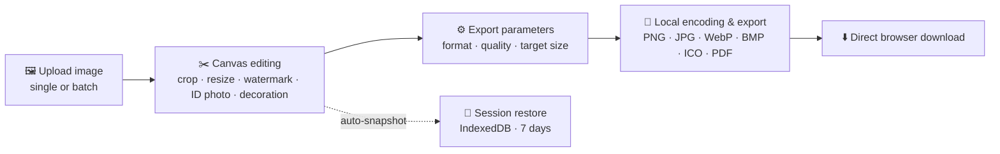

<div align="center">


# PhotoChange

**A pure-frontend image workbench — crop · resize · ID photos · watermark · batch convert, all done locally**

[](https://github.com/Mocas-12/photochange/actions/workflows/ci.yml)
[](https://mocas-12.github.io/photochange/)
[](https://developer.mozilla.org/zh-CN/docs/Web/HTML)
[](https://developer.mozilla.org/zh-CN/docs/Web/JavaScript)
[](https://github.com/parallax/jsPDF)

**[🌐 Live Preview (GitHub Pages)](https://mocas-12.github.io/photochange/)**

**English** | [简体中文](./README.zh-CN.md)

*Open the page → scroll down to the workbench → drop in an image to edit and export*

</div>

---

## 📖 Table of Contents

- [Features](#-features)
- [UI Design](#-ui-design)
- [How It Works](#-how-it-works)
- [Project Structure](#-project-structure)
- [Quick Start](#-quick-start)
- [Tests](#-tests)
- [Support the Developer](#-support-the-developer)
- [FAQ](#-faq)
- [Privacy & Security](#-privacy--security)
- [License](#-license)

## ✨ Features

- 🖼️ **Multiple ways to upload**: pick via button or drag & drop; supports PNG / JPG / JPEG / WebP / BMP / AVIF / HEIC; multi-select turns on batch mode
- 🔍 **Canvas viewer**: zoom (20%–400%), ±90° rotation, ruler grid for alignment
- ✂️ **Free crop**: free / 1:1 / 4:3 / 16:9 / 3:2 aspect ratios, with a semi-transparent mask outside the selection for a clear preview
- 📐 **Resize**: width/height inputs with aspect-ratio lock, built-in presets for avatars, 1-inch/2-inch ID photos, official-account covers, Xiaohongshu, HD/FHD and more
- 💧 **Watermark**: text or logo image, single (9-grid position) or tiled diagonal anti-theft mode, opacity & size control
- 🪪 **ID photo tools**: one-click background color replacement (white / blue / red + custom, auto-detected original color, edge feathering) and auto layout on 4×6" paper (300 DPI, print-ready)
- 🎀 **Decoration**: rounded corners and photo borders with custom color
- 📦 **Batch mode**: select multiple files, apply watermark / size / export settings to all, per-file status list
- ↩️ **Undo / Reset**: up to 20 undo steps (Ctrl+Z), one-click reset to the original image
- 💾 **Multi-format export**: PNG / JPG / WebP / BMP / ICO / PDF (auto-fitted and centered on an A4 page)
- 🎯 **Target-size compression**: "compress to N KB" binary-searches the closest quality setting automatically
- 📊 **Live estimate**: the badge at the bottom-right of the canvas shows current format, resolution and export size
- 🔄 **Session restore**: the editing snapshot is auto-saved locally (IndexedDB, valid for 7 days); refresh or accidentally close the page and restore with one click
- 📲 **PWA**: installable to the home screen, app-shell cached by a service worker for offline use
- 🔒 **Privacy**: exports go through canvas re-encoding, so EXIF metadata (including GPS location) is stripped automatically
- 💛 **Developer-support model**: completely free — unlimited exports, no feature locks, no account required. If it helps you, consider buying the author a coffee

## 🎨 UI Design

| Element | Design |
| --- | --- |
| Theme | Deep Space Glow: near-black blue base + three layers of ambient glow |
| Panels | Glassmorphism: semi-transparent background + backdrop blur + thin border |
| Accent | Blue→purple gradient primary buttons + outer glow |
| Page layout | Home / workbench dual full-page switching (wheel · touch · keyboard · arrows) |
| Canvas | Ruler-grid texture + empty-state hint + bottom-right info badge |
| Motion | Staggered hero entrance, title gradient pan, pointer parallax, occasional meteors, breathing dropzone, button shine; respects the system "reduce motion" setting |

## 🧠 How It Works



1. **Local loading**: the file is decoded via `createObjectURL` + `Image` and drawn onto the working canvas (capped at 4096 px on the long side); HEIC/AVIF go through a self-hosted heic2any first. The original is kept separately for one-click reset
2. **Non-destructive editing**: crop / resize / watermark / adjustments are all done via Canvas, with each step pushed onto the undo stack (up to 20 steps, memory-capped so large photos can't crash the tab)
3. **ID-photo background replacement**: the original background color is auto-detected from the four corners; pixels within the tolerance become the new color with a smoothstep-feathered edge. "Print layout" tiles the photo onto a 4×6" sheet at 300 DPI
4. **Size compression**: once a target size is set, a binary search over the quality parameter (0.05–0.95, up to 9 rounds) picks the highest quality that stays under the target
5. **PDF export**: the canvas is converted to JPEG and embedded into an A4 page via jsPDF, auto-scaled and centered
6. **Session & offline**: edits are snapshot into IndexedDB (watermark/adjust metadata included) and can be restored after a refresh within 7 days; a service worker caches the app shell so the installed PWA works offline
7. **Fully local**: images and export results never leave the browser — no server involved at any point; exports are re-encoded through the canvas, stripping EXIF metadata (including GPS) automatically

## 📁 Project Structure

```text
photochange/
├── index.html          # Single-page structure: workbench + custom toast overlay (no inline scripts, CSP-enforced)
├── style.css           # Deep Space Glow theme (glassmorphism + ambient glow + self-hosted Inter)
├── main.js             # Editing orchestrator: crop / resize / watermark / export flows
├── js/
│   ├── exporters.js    # Pure encoders: BMP / ICO / target-size binary search / on-demand jsPDF
│   ├── session.js      # Session storage: IndexedDB read/write
│   ├── view-tools.js   # View transforms: zoom / rotate / mirror / ruler + toolbar visibility
│   ├── alerts.js       # Custom alert overlay: focus management + background inert
│   └── bootstrap.js    # Visitor-counter fallback + service-worker registration
├── fonts/              # Self-hosted Inter variable font (latin subset)
├── page-switch.js      # Home ↔ workbench full-page switching
├── info-badge.js       # Status badge: live resolution & size estimates
├── pointer-fx.js       # Pointer-following effects (auto-paused on the workbench page)
├── manifest.webmanifest / service-worker.js  # PWA: installable + offline shell (pre-cache list auto-generated)
├── vendor/             # Self-hosted libs (jsPDF, heic2any — both loaded on demand)
├── tests/              # Playwright suite (npm test)
└── wechatpay/
    └── wechatpay.jpg   # Payment QR code image
```

## 🚀 Quick Start

No dependencies to install — run it locally with any static server:

```bash
git clone https://github.com/Mocas-12/photochange.git
cd photochange
python -m http.server 5173
# Open http://localhost:5173/ in the browser
```

| Command | Description |
| --- | --- |
| `python -m http.server 5173` | Python's built-in static server (recommended) |
| `npx serve .` | Node-based alternative |

> Pushing to the `main` branch automatically updates the live GitHub Pages site — no manual build needed.

## 🧪 Tests

Smoke tests run automatically in CI on every push/PR (Playwright + GitHub Actions). To run them locally:

```bash
npm install
npx playwright install chromium
npm test
```

29 tests cover the crop-coordinate matrix (rotation × mirror), the three resize fit-modes, watermark 9-grid positioning, keyboard cropping, export policy, target-size export, BMP/ICO encoders, render regression (deterministic pixel assertions over a fixed op sequence), first-screen size budgets, undo, ID-photo background replacement & print layout, decoration, tiled watermark, batch mode, session restore (parameters + view transforms), and the dual-screen page switch.

## 💛 Support the Developer

This project runs on a **developer-support model**, stated here explicitly:

- **Completely free**: every feature is unlimited — no export caps, no feature locks, no account required
- **No paywall**: there are no activation codes and no "pro" tier. If any earlier wording suggested otherwise, that was outdated documentation — the tool itself has always run fully local and fully featured
- **Support is optional**: if the tool helps you, [buy the author a coffee](https://mbd.pub/o/bread/mbd-YZWblJ9paA==) (there's also a link in the export bar). It's a purely voluntary thank-you and unlocks nothing because nothing is locked
- Contributions go toward domains, CDN and continued development

## ❓ FAQ

<details>
<summary><b>How do I make a printable ID-photo sheet?</b></summary>

- Open <b>ID Photo</b>: the original background color is auto-detected — pick white / blue / red (or a custom color) and apply; then click <b>Print Layout</b> to tile the photo onto a 4×6" sheet (300 DPI) ready to print and cut. The built-in 1-inch / 2-inch presets under <b>Resize</b> give the standard photo dimensions first
</details>

<details>
<summary><b>Does background replacement work on complex backgrounds?</b></summary>

- It works on roughly uniform backgrounds (studio-style ID photos, solid backdrops) via color-distance matching. Busy or gradient backgrounds need AI matting, which is not built in yet
</details>

<details>
<summary><b>The browser asks "allow multiple downloads" during batch export</b></summary>

- Allow it. Each image is exported as an individual file named after the original; the batch panel shows per-file status and output size
</details>

<details>
<summary><b>I accidentally refreshed and lost my edits</b></summary>

- Edits are auto-saved locally (IndexedDB). Reopen the page within 7 days and click <b>Restore</b> on the banner to pick up where you left off
</details>

<details>
<summary><b>Why is there no "quality" option for PNG</b></summary>

- PNG uses lossless compression and offers no lossy "quality" parameter; file size depends mainly on image content and resolution
</details>

<details>
<summary><b>I set "compress to N KB" but the exported PNG did not shrink</b></summary>

- PNG cannot be compressed to a target size; the app shows a toast and automatically falls back to JPG compression for export
</details>

<details>
<summary><b>How sharp is the PDF</b></summary>

- It actually embeds the current canvas as a JPEG into the PDF; sharpness depends on the canvas resolution — scale up the dimensions before exporting if needed
</details>

<details>
<summary><b>The exported file is still too large — what now</b></summary>

- Set a "compress to N KB" target size, lower the JPG / WebP quality, or first reduce the resolution under "Resize"
</details>

## 🔒 Privacy & Security

- 🖼️ Images are processed entirely in the browser — **never uploaded, never stored, never routed through any server**
- 🔒 Exports are re-encoded through the canvas, so EXIF metadata (including GPS location) is stripped automatically
- 🔑 No sign-up or login; editing snapshots and session data stay on this device only
- 🛡️ A site-wide Content-Security-Policy constrains script origins; jsPDF / heic2any are self-hosted and loaded on demand
- 📊 Visitor analytics record anonymous counts only, with no personally identifiable information collected

## 📄 License

This project is open-sourced under the [MIT](./LICENSE) license — free to use, modify and redistribute (commercial use included), as long as the copyright and license notice are kept in your copy.

---

<div align="center">

**Made with 💙**

🌐 [Live Preview](https://mocas-12.github.io/photochange/) · 🐛 [Report an Issue](https://github.com/Mocas-12/photochange/issues)

</div>
