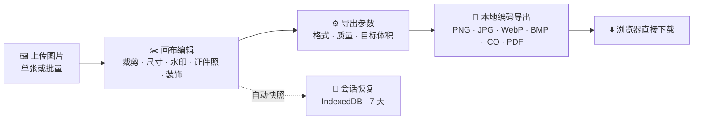

<div align="center">


# PhotoChange

**纯前端图片工作台 —— 裁剪 · 尺寸 · 证件照 · 水印 · 批量转换，全程本地完成**

[](https://github.com/Mocas-12/photochange/actions/workflows/ci.yml)
[](https://mocas-12.github.io/photochange/)
[](https://developer.mozilla.org/zh-CN/docs/Web/HTML)
[](https://developer.mozilla.org/zh-CN/docs/Web/JavaScript)
[](https://github.com/parallax/jsPDF)

**[🌐 在线体验（GitHub Pages）](https://mocas-12.github.io/photochange/)**

[English](./README.md) | **简体中文**

*打开页面 → 下滑进入工作台 → 拖入图片即可编辑导出*

</div>

---

## 📖 目录

- [功能特性](#-功能特性)
- [界面设计](#-界面设计)
- [工作原理](#-工作原理)
- [项目结构](#-项目结构)
- [快速开始](#-快速开始)
- [测试](#-测试)
- [额度与激活](#-额度与激活)
- [常见问题](#-常见问题)
- [隐私与安全](#-隐私与安全)
- [许可证](#-许可证)

## ✨ 功能特性

- 🖼️ **多方式上传**：按钮选择或直接拖拽，支持 PNG / JPG / JPEG / WebP / BMP / AVIF / HEIC，多选自动进入批量模式
- 🔍 **画布查看**：缩放（20%–400%）、±90° 旋转、标尺网格辅助对齐
- ✂️ **自由裁剪**：自由 / 1:1 / 4:3 / 16:9 / 3:2 长宽比，选区外部半透明遮罩便于观察
- 📐 **尺寸调整**：宽高输入 + 锁定比例，内置头像、一寸/二寸证件照、公众号封面、小红书、HD/FHD 等常用预设
- 💧 **水印**：文字或 Logo 图片，单个（九宫格定位）或斜向平铺防盗模式，透明度与大小可调
- 🪪 **证件照工具**：一键换底色（白 / 蓝 / 红 + 自定义，自动探测原背景，边缘羽化过渡），自动生成六寸相纸打印排版（300 DPI 可直接裁切）
- 🎀 **装饰**：圆角与自定义颜色照片边框
- 📦 **批量处理**：多选上传，统一套用水印 / 尺寸 / 导出设置，逐张显示状态
- ↩️ **撤销 / 重置**：最多 20 步撤销（Ctrl+Z），一键重置为原图
- 💾 **多格式导出**：PNG / JPG / WebP / BMP / ICO / PDF（A4 页面自适应居中）
- 🎯 **目标体积压缩**：「压到 N KB」自动二分搜索最接近的质量参数
- 📊 **实时预估**：画布右下角徽章显示当前格式、分辨率与导出体积
- 🔄 **会话恢复**：编辑快照自动存本地（IndexedDB，7 天内有效），刷新/误关一键恢复
- 📲 **PWA**：可安装到桌面 / 主屏，Service Worker 缓存应用外壳，支持离线使用
- 🔒 **隐私**：导出经画布重编码，自动剥离 EXIF（含 GPS 位置）等元数据
- 🔑 **额度系统**：5 次免费导出，激活码永久解锁，全程无需账号

## 🎨 界面设计

| 元素 | 设计 |
| --- | --- |
| 主题 | 深空辉光（Deep Space Glow）：近黑蓝底 + 三层氛围光晕 |
| 面板 | 玻璃拟态：半透明底 + 背景模糊 + 细描边 |
| 强调色 | 蓝→紫渐变主按钮 + 外发光 |
| 页面结构 | 首页 / 工作台双屏整页切换（滚轮 · 触摸 · 键盘 · 箭头） |
| 画布 | 标尺网格底纹 + 空状态提示 + 右下角信息徽章 |
| 动效 | 首屏阶梯入场、标题流光、指针视差、低频流星、拖放区呼吸、按钮流光；尊重系统「减弱动态效果」设置 |

## 🧠 工作原理



1. **本地加载**：文件经 `createObjectURL` + `Image` 解码后绘制到工作画布（长边超 4096 自动等比缩小），HEIC/AVIF 先经自托管的 heic2any 转码；原始图独立保存以便一键重置
2. **无损编辑**：裁剪 / 缩放 / 水印 / 调整全部通过 Canvas 完成，每步压入撤销栈（最多 20 步，且按内存封顶，大图不会撑爆标签页）
3. **证件照换底**：四角取色自动探测原背景，容差内像素替换为目标色并用 smoothstep 羽化过渡；「生成排版」把照片铺到 4×6 英寸相纸（300 DPI）
4. **体积压缩**：设定目标体积后，对质量参数做二分搜索（0.05–0.95，最多 9 轮），取不超过目标的最大质量
5. **PDF 导出**：画布转 JPEG 后经 jsPDF 嵌入 A4 页面，自适应缩放并居中
6. **会话与离线**：编辑快照自动写入 IndexedDB（含水印/调整元数据），7 天内刷新可一键恢复；Service Worker 缓存应用外壳，安装后可离线使用
7. **全程本地**：图片与导出结果均不离开浏览器，无任何服务器参与；导出经画布重编码，自动剥离 EXIF（含 GPS 位置）等元数据

## 📁 项目结构

```text
photochange/
├── index.html          # 单页结构：工作台 + 激活弹窗 + 自定义提示
├── style.css           # 深空辉光主题（玻璃拟态 + 氛围光晕）
├── main.js             # 编辑核心：裁剪 / 尺寸 / 水印 / 导出
├── quota.js            # 免费额度计数与激活码校验
├── page-switch.js      # 首页 ↔ 工作台整页切换
├── info-badge.js       # 状态徽章：分辨率与体积实时预估
├── pointer-fx.js       # 指针跟随特效
├── manifest.webmanifest / service-worker.js  # PWA：可安装 + 离线外壳
├── vendor/             # 自托管第三方库（jsPDF、heic2any）
├── tests/              # Playwright 冒烟测试（npm test）
└── wechatpay/
    └── wechatpay.jpg   # 收款码图片
```

## 🚀 快速开始

无需安装任何依赖，任选一种静态服务器即可本地运行：

```bash
git clone https://github.com/Mocas-12/photochange.git
cd photochange
python -m http.server 5173
# 浏览器访问 http://localhost:5173/
```

| 命令 | 说明 |
| --- | --- |
| `python -m http.server 5173` | Python 自带静态服务器（推荐） |
| `npx serve .` | Node 环境替代方案 |

> 推送（push）到 `main` 分支后，GitHub Pages 自动更新线上站点，无需手动构建。

## 🧪 测试

每次 push / PR 时 CI 会自动跑冒烟测试（Playwright + GitHub Actions）。本地运行：

```bash
npm install
npx playwright install chromium
npm test
```

共 22 个用例，覆盖裁剪坐标矩阵（旋转 × 镜像）、免费额度记账、目标体积导出、BMP/ICO 编码器、撤销、证件照换底与排版、装饰、平铺水印、批量处理、会话恢复、双屏切换。

## 🔑 额度与激活

- 免费模式：每台设备内置 5 次免费导出（本地计数，无需注册）
- 用尽后点击导出会自动弹出激活弹窗，可跳转「面包多」获取激活码
- 激活码格式为 `CYxxxS1X`，激活后本设备永久解锁，不限导出次数
- 额度与激活状态保存在浏览器 localStorage，清除浏览器数据会重置

## ❓ 常见问题

<details>
<summary><b>怎么制作可打印的证件照排版？</b></summary>

- 打开<b>证件照</b>面板：自动探测原背景色，选白 / 蓝 / 红（或自定义）后点「换底色」；再点「生成六寸排版」即可得到 4×6 英寸 300 DPI 的排版图，直接打印裁切。标准尺寸可先用<b>尺寸</b>里的一寸 / 二寸预设
</details>

<details>
<summary><b>换底色对复杂背景有效吗？</b></summary>

- 对大致均匀的背景（影棚式证件照、纯色背景）效果最好，采用色距匹配；复杂花纹或渐变背景需要 AI 抠图，暂未内置
</details>

<details>
<summary><b>批量导出时浏览器提示「是否允许下载多个文件」</b></summary>

- 点击允许即可。每张图按原文件名单独导出，批量面板会逐张显示状态与输出体积
</details>

<details>
<summary><b>不小心刷新，编辑到一半的图丢了</b></summary>

- 编辑快照会自动存本地（IndexedDB）。7 天内重新打开页面，点击横幅上的「恢复编辑」即可继续
</details>

<details>
<summary><b>为什么 PNG 没有「质量」选项</b></summary>

- PNG 为无损压缩，不提供有损「质量」参数；文件大小主要由图片内容与分辨率决定
</details>

<details>
<summary><b>填了「压到 N KB」但导出 PNG 没生效</b></summary>

- PNG 无法按体积压缩，应用会弹窗提示并自动改用 JPG 压缩导出
</details>

<details>
<summary><b>PDF 的清晰度如何</b></summary>

- 实际是把当前画布转为 JPEG 嵌入 PDF；清晰度取决于画布分辨率，导出前可先放大尺寸
</details>

<details>
<summary><b>导出文件还是太大怎么办</b></summary>

- 填写「压到 N KB」目标体积，或降低 JPG / WebP 质量，或先在「尺寸」中缩小分辨率
</details>

<details>
<summary><b>换设备 / 清浏览器数据后额度重置了吗</b></summary>

- 是。额度仅保存在本设备 localStorage 中，不与任何账号绑定
</details>

## 🔒 隐私与安全

- 🖼️ 图片全程在浏览器本地处理，**不上传、不落库、不经过任何服务器**
- 🔒 导出经画布重编码，自动剥离 EXIF（含 GPS 位置）等元数据
- 🔑 无需注册登录，额度与激活状态仅保存在本设备
- 📊 访客统计只记录匿名计数，不采集个人身份信息

## 📄 许可证

本项目用于学习与演示，未设置开源许可证；如需复用请自行 fork。

---

<div align="center">

**Made with 💙**

🌐 [在线体验](https://mocas-12.github.io/photochange/) · 🐛 [问题反馈](https://github.com/Mocas-12/photochange/issues)

</div>
